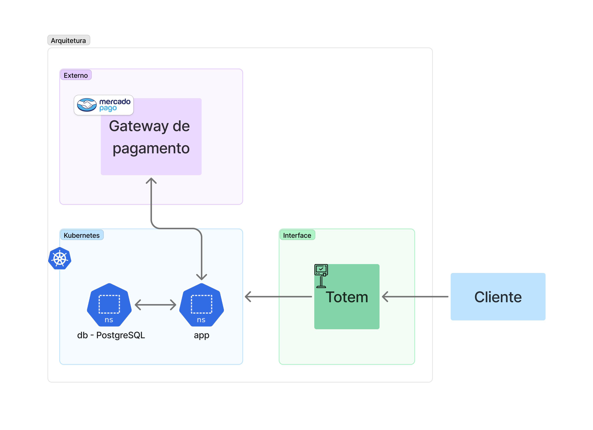
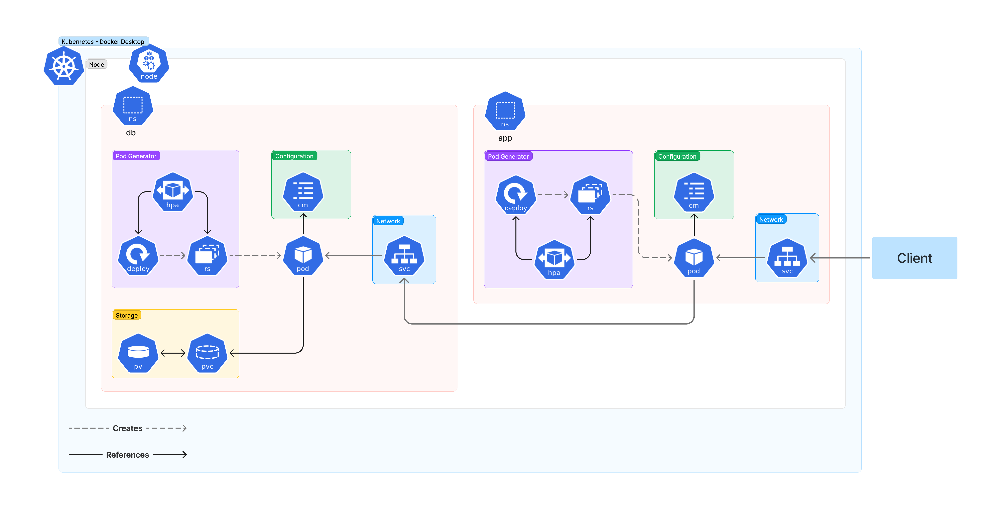

# FAST FOOD TECH CHALLENGE

# docker #node #yarn #typescript #fastify #prisma #postgres

This project is an API for a fast food system.

## Event Storming

[https://miro.com/app/board/uXjVKXKeOYw=/](https://miro.com/app/board/uXjVKXKeOYw=/)

## Structure

This repository contains the source code for a project that implements a domain-driven design (DDD) with hexagonal architecture. The project structure is as follows:

```folder
project-root
│── src
│   ├── application
│   │   ├── controllers
│   │   │   ├── CustomerController.ts
│   │   │   ├── OrderController.ts
│   │   │   └── ProductController.ts
│   │   ├── dtos
│   │   │   ├── ComboDto.ts
│   │   │   ├── CustomerDtos.ts
│   │   │   ├── OrderDto.ts
│   │   │   └── ProductDto.ts
│   │   ├── routes
│   │   │   ├── CustomerRoutes.ts
│   │   │   ├── index.ts
│   │   │   ├── OrderRoutes.ts
│   │   │   └── ProductRoutes.ts
│   │   └── schemas
│   │       ├── CreateCustomer.ts
│   │       ├── CreateOrder.ts
│   │       ├── CreateProduct.ts
│   │       ├── DeleteProduct.ts
│   │       ├── EditProduct.ts
│   │       ├── IdentifyCustomerSchema.ts
│   │       ├── ListOrders.ts
│   │       └── ListProductsByCategory.ts
│   ├── config
│   │   └── app.ts
│   ├── core
│   │   ├── domain
│   │   │   ├── entities
│   │   │   │   ├── Combo.ts
│   │   │   │   ├── Customer.ts
│   │   │   │   ├── Order.ts
│   │   │   │   └── Product.ts
│   │   │   ├── events
│   │   │   │   ├── ComboEvents.ts
│   │   │   │   ├── CustomerEvents.ts
│   │   │   │   ├── OrderEvents.ts
│   │   │   │   └── ProductEvents.ts
│   │   │   ├── use-cases
│   │   │   │   ├── ComboUseCase.ts
│   │   │   │   ├── CustomerUseCase.ts
│   │   │   │   ├── OrderUseCase.ts
│   │   │   │   └── ProductUseCase.ts
│   │   │   └── value-objects
│   │   │       ├── CPF.ts
│   │   │       ├── OrderStatus.ts
│   │   │       ├── PaymentStatus.ts
│   │   │       ├── ProductCategory.ts
│   │   │       └── ProductImage.ts
│   │   └── repositories
│   │       ├── ComboRepository.ts
│   │       ├── CustomerRepository.ts
│   │       ├── OrderRepository.ts
│   │       └── ProductRepository.ts
│   ├── index.ts
│   └── infra
│       └── repositories
│           ├── memory
│           │   ├── ComboRepository.ts
│           │   ├── CustomerRepository.ts
│           │   ├── OrderRepository.ts
│           │   └── ProductRepository.ts
│           └── prisma
│               ├── ComboRepository.ts
│               ├── CustomerRepository.ts
│               ├── index.ts
│               ├── OrderRepository.ts
│               └── ProductRepository.ts
├── tests
└── README.md
```

## Domain Model

### Product

- `Product.ts`: Defines the `Product` entity with properties such as `category`, `price`, `description`, and `images`.
- `ProductRepository.ts`: Interface for the product repository, including methods such as `addProduct`, `editProduct`, and `removeProduct`.
- `ProductEvents.ts`: Events like `ProductRegistered`, `ProductEdited`, and `ProductRemoved`.

### Order

- `Order.ts`: Aggregate managing orders, including methods to add products or combos to the order.
- `OrderRepository.ts`: Interface for the order repository, responsible for saving and retrieving orders.
- `OrderEvents.ts`: Events like `OrderCreated`, `OrderUpdated`, and `OrderConfirmed`.

### Customer

- `Customer.ts`: Entity representing the customer, including data such as `CPF`, `name`, and `email`.
- `CustomerRepository.ts`: Interface for the customer repository, including methods for creating and managing customer information.
- `CustomerEvents.ts`: Events like `CustomerRegistered` and `CustomerUpdated`.

### Combo

- `Combo.ts`: Aggregate for managing combos, which are collections of products.
- `ComboRepository.ts`: Interface for the combo repository.
- `ComboEvents.ts`: Events like `ComboCreated` and `ComboUpdated`.

## Domain UseCases

- `ProductUseCase.ts`: UseCases related to product management.
- `OrderUseCase.ts`: UseCases for handling orders, including confirmation and status updates.
- `CustomerUseCase.ts`: UseCases for managing customers, including registration and data updates.
- `ComboUseCase.ts`: UseCases for managing the creation and modification of combos.

Please refer to the individual files for more details on their implementation.

## Getting Started

### With Docker

1. Clone the repository.
2. Build the project.

   - Run in the terminal

     ```
     docker compose build
     ```

3. Start the application.

   - Run in the terminal

     ```
     docker compose up
     ```

### With Kubernetes

1. Clone the repository.

2. Build the app image and push it to Docker Hub

   - Run in the terminal

     ```bash
     sudo docker build -t <your_username>/<your_image_name>:<image_version>
     docker push <your_username>/<your_image_name>:<image_version>
     ```

3. Create PG database.

   - Run in the terminal

     ```bash
     kubectl apply -f /K8S/db
     kubectl apply -f /K8S/app
     ```


### Standalone

To run the project, follow these steps:

1. Clone the repository.
2. Install the dependencies.

   - Run in the terminal

     ```
     docker compose up db
     ```

3. Build the project.

   - Run in the other terminal

     ```
     yarn build
     yarn migrate
     ```

4. Start the application.

   ```
   yarn dev
   ```

5. Access the application [http://localhost:3000/](http://localhost:3000/)

## Run Swagger

Access the application [http://localhost:3000/documentation](http://localhost:3000/documentation)

## Access database

1. Access container

   ```
   <!-- For Docker -->
   docker exec -it postgres_container bash

   <!-- For K8S -->
   kubectl exec -it <pod_name> bash
   ```

2. Conect database

   ```
   psql -U fast-food -d fast-food
   ```

3. List tables

   ```
   \dt
   ```

## Run test

### Unit test

After setup de application, run:

```
yarn test
```

### Integration test

After setup de application standalone, run:

```
yarn test:cucumber
```

## Diagrams

### System architecture


### Kubernetes infrastructure


## Contributing

Feel free to explore the code and make any necessary modifications to suit your needs.

### Commit description

Use the tags:

feat: (new feature for the user, not a new feature for build script) fix: (bug fix for the user, not a fix to a build script) docs: (changes to the documentation) style: (formatting, missing semi colons, etc; no production code change) refactor: (refactoring production code, eg. renaming a variable) test: (adding missing tests, refactoring tests; no production code change) chore: (updating grunt tasks etc; no production code change)

Ref.: [Semantic Commit Messages](https://gist.github.com/joshbuchea/6f47e86d2510bce28f8e7f42ae84c716#file-semantic-commit-messages-md)

## License

This project is licensed under the MIT License. See the LICENSE file for more information.
