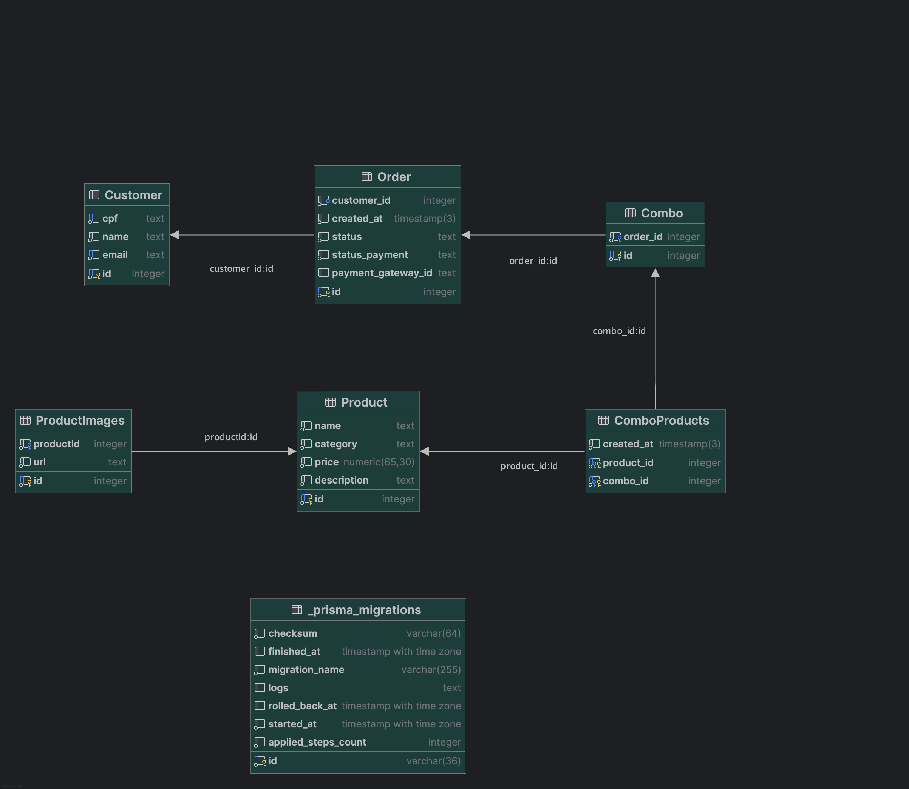
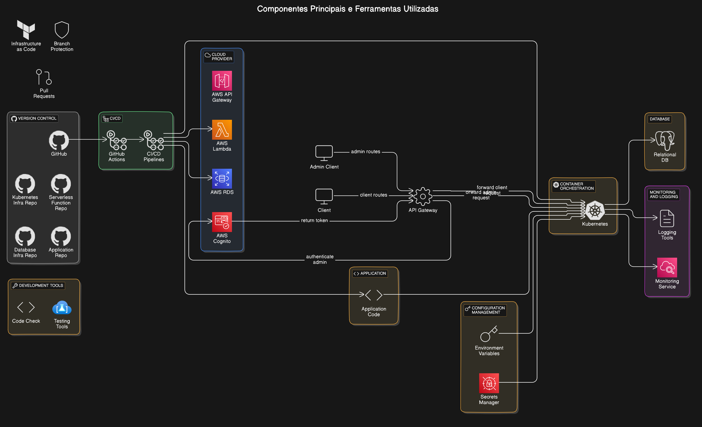

# FAST FOOD TECH CHALLENGE - FASE 4

# docker #node #yarn #typescript #fastify #prisma #postgres

This project is an API for a fast food system.

## Event Storming

[https://miro.com/app/board/uXjVKXKeOYw=/](https://miro.com/app/board/uXjVKXKeOYw=/)

## Video

[Link to video that explain this project](https://www.youtube.com/watch?v=rlWsCU_idOI)

## Structure

This repository contains the source code for a project that implements a domain-driven design (DDD) with hexagonal architecture. The project structure is as follows:

```folder
project-root
│── src
│   ├── application
│   │   ├── controllers
│   │   │   ├── CustomerController.ts
│   │   │   ├── OrderController.ts
│   │   │   └── ProductController.ts
│   │   ├── dtos
│   │   │   ├── ComboDto.ts
│   │   │   ├── CustomerDtos.ts
│   │   │   ├── OrderDto.ts
│   │   │   └── ProductDto.ts
│   │   ├── routes
│   │   │   ├── CustomerRoutes.ts
│   │   │   ├── index.ts
│   │   │   ├── OrderRoutes.ts
│   │   │   └── ProductRoutes.ts
│   │   └── schemas
│   │       ├── CreateCustomer.ts
│   │       ├── CreateOrder.ts
│   │       ├── CreateProduct.ts
│   │       ├── DeleteProduct.ts
│   │       ├── EditProduct.ts
│   │       ├── IdentifyCustomerSchema.ts
│   │       ├── ListOrders.ts
│   │       └── ListProductsByCategory.ts
│   ├── config
│   │   └── app.ts
│   ├── core
│   │   ├── domain
│   │   │   ├── entities
│   │   │   │   ├── Combo.ts
│   │   │   │   ├── Customer.ts
│   │   │   │   ├── Order.ts
│   │   │   │   └── Product.ts
│   │   │   ├── events
│   │   │   │   ├── ComboEvents.ts
│   │   │   │   ├── CustomerEvents.ts
│   │   │   │   ├── OrderEvents.ts
│   │   │   │   └── ProductEvents.ts
│   │   │   ├── use-cases
│   │   │   │   ├── ComboUseCase.ts
│   │   │   │   ├── CustomerUseCase.ts
│   │   │   │   ├── OrderUseCase.ts
│   │   │   │   └── ProductUseCase.ts
│   │   │   └── value-objects
│   │   │       ├── CPF.ts
│   │   │       ├── OrderStatus.ts
│   │   │       ├── PaymentStatus.ts
│   │   │       ├── ProductCategory.ts
│   │   │       └── ProductImage.ts
│   │   └── repositories
│   │       ├── ComboRepository.ts
│   │       ├── CustomerRepository.ts
│   │       ├── OrderRepository.ts
│   │       └── ProductRepository.ts
│   ├── index.ts
│   └── infra
│       └── repositories
│           ├── memory
│           │   ├── ComboRepository.ts
│           │   ├── CustomerRepository.ts
│           │   ├── OrderRepository.ts
│           │   └── ProductRepository.ts
│           └── prisma
│               ├── ComboRepository.ts
│               ├── CustomerRepository.ts
│               ├── index.ts
│               ├── OrderRepository.ts
│               └── ProductRepository.ts
├── tests
└── README.md
```

## Domain Model

### Product

- `Product.ts`: Defines the `Product` entity with properties such as `category`, `price`, `description`, and `images`.
- `ProductRepository.ts`: Interface for the product repository, including methods such as `addProduct`, `editProduct`, and `removeProduct`.
- `ProductEvents.ts`: Events like `ProductRegistered`, `ProductEdited`, and `ProductRemoved`.

### Order

- `Order.ts`: Aggregate managing orders, including methods to add products or combos to the order.
- `OrderRepository.ts`: Interface for the order repository, responsible for saving and retrieving orders.
- `OrderEvents.ts`: Events like `OrderCreated`, `OrderUpdated`, and `OrderConfirmed`.

### Customer

- `Customer.ts`: Entity representing the customer, including data such as `CPF`, `name`, and `email`.
- `CustomerRepository.ts`: Interface for the customer repository, including methods for creating and managing customer information.
- `CustomerEvents.ts`: Events like `CustomerRegistered` and `CustomerUpdated`.

### Combo

- `Combo.ts`: Aggregate for managing combos, which are collections of products.
- `ComboRepository.ts`: Interface for the combo repository.
- `ComboEvents.ts`: Events like `ComboCreated` and `ComboUpdated`.

## Domain UseCases

- `ProductUseCase.ts`: UseCases related to product management.
- `OrderUseCase.ts`: UseCases for handling orders, including confirmation and status updates.
- `CustomerUseCase.ts`: UseCases for managing customers, including registration and data updates.
- `ComboUseCase.ts`: UseCases for managing the creation and modification of combos.

Please refer to the individual files for more details on their implementation.

## Data Modeling Documentation - Fast-Food System

### 1. model overview

The data model presented represents a system for managing fast-food orders. It includes entities for customers, products, orders, combos and product images.

### 2. entities and relationships

#### 2.1 Customer

- Attributes:
  - id (PK): serial
  - cpf: text (unique)
  - name: text
  - email: text (unique)
- Relationships:
  - One-to-Many with Order

#### 2.2 Product

- Attributes:
  - id (PK): serial
  - name: text
  - category: text
  - price: numeric(65,30)
  - description: text
- Relationships:
  - One-to-Many with ProductImages
  - Many-to-Many with Combo through ComboProducts

#### 2.3 ProductImages

- Attributes:
  - id (PK): serial
  - productId (FK): integer
  - url: text
- Relationships:
  - Many-to-One with Product

#### 2.4 Order

- Attributes:
  - id (PK): serial
  - customer_id (FK): integer
  - created_at: timestamp(3)
  - status: text
  - payment_status: text
  - payment_gateway_id: text
- Relationships:
  - Many-to-One with Customer
  - One-to-Many with Combo

#### 2.5 Combo

- Attributes:
  - id (PK): serial
  - order_id (FK): integer
- Relationships:
  - Many-to-One with Order
  - Many-to-Many with Product through ComboProducts

#### 2.6 ComboProducts

- Attributes:
  - product_id (PK, FK): integer
  - combo_id (PK, FK): integer
  - created_at: timestamp(3)
- Relationships:
  - Represents the Many-to-Many relationship between Combo and Product

### 3. Justification for the choice of database

The data model presented is implemented in a relational database, specifically PostgreSQL. This choice is justified by the following factors:

1. **Relational data structure**: The system requires a well-structured data model with clear relationships between entities, which is ideal for relational databases.

2. **Data Integrity**: PostgreSQL offers robust support for primary keys, foreign keys and constraints, ensuring referential integrity and data consistency.

3. **ACID Transactions**: For an ordering system, it is crucial to have support for ACID transactions (Atomicity, Consistency, Isolation, Durability), which PostgreSQL provides.

4. **Scalability**: PostgreSQL is known for its good performance and ability to handle large volumes of data, which is important for an ordering system that can grow over time.

5. **Advanced Features**: PostgreSQL offers advanced features such as indexes, views, stored procedures and triggers, which can be useful for future optimizations and complex business logic.

6. **ORM compatibility**: The use of capitalized table names suggests the use of an ORM (possibly Prisma, given the table name \_prisma_migrations). PostgreSQL has excellent support for several ORM tools.

7. **Open Source and Active Community**: Being open source, PostgreSQL has an active community, extensive documentation and is constantly updated with new features and security improvements.

8. **Flexible Data Types**: PostgreSQL supports a wide variety of data types, including JSON, which can be useful for storing semi-structured data in the future.

### 4. Normalization of the Data Model

The data model was designed following the principles of normalization, reaching up to Third Normal Form (3NF) and possibly Boyce-Codd Normal Form (BCNF) in all its tables. This ensures that redundancy and problematic dependencies in the data are minimized.

#### 4.1 First Normal Form (1NF)

All tables are in 1NF because:

- Each column contains atomic (indivisible) values
- There are no repetitive groups
- Each table has a defined primary key

Example: The “Customer” table has a primary key (id) and all its attributes are atomic.

#### 4.2 Second Normal Form (2NF)

The tables are in 2NF because:

- They are in 1NF
- All non-key attributes are totally dependent on the primary key

Example: In the “Product” table, all the attributes (name, category, price, description) are totally dependent on the primary key (id).

#### 4.3 Third Normal Form (3NF)

The tables are in 3NF because:

- They are in 2NF
- There are no transitive dependencies between non-key attributes

Example: In the “Order” table, there are no obvious transitive dependencies between the non-key attributes.

Applying these normal forms to the data model helps to:

1. minimizing data redundancy
2. Ensuring data integrity
3. Facilitating database maintenance and updating
4. Improve the flexibility of the schema for future extensions

This standardized structure provides a solid foundation for the system, enabling efficient and consistent management of data related to fast-food orders.

## Getting Started

### With Docker

1. Clone the repository.
2. Build the project.

   - Run in the terminal

     ```
     docker compose build
     ```

3. Start the application.

   - Run in the terminal

     ```
     docker compose up
     ```

### With Kubernetes

1. Clone the repository.

2. Build the app image and push it to Docker Hub

   - Run in the terminal

     ```bash
     sudo docker build -t <your_username>/<your_image_name>:<image_version>
     docker push <your_username>/<your_image_name>:<image_version>
     ```

3. Create PG database.

   - Run in the terminal

     ```bash
     kubectl apply -f /K8S/db
     kubectl apply -f /K8S/app
     ```

### Standalone

To run the project, follow these steps:

1. Clone the repository.
2. Install the dependencies.

   - Run in the terminal

     ```
     docker compose up db
     ```

3. Build the project.

   - Run in the other terminal

     ```
     yarn build
     yarn migrate
     ```

4. Start the application.

   ```
   yarn dev
   ```

5. Access the application [http://localhost:3000/](http://localhost:3000/)

## Run Swagger

Access the application [http://localhost:3000/documentation](http://localhost:3000/documentation)

or

Access the webpage from [swagger.json](https://viniciussantos45.github.io/fast-food-tech-challenge/swagger.html)

## Access database

1. Access container

   ```
   <!-- For Docker -->
   docker exec -it postgres_container bash

   <!-- For K8S -->
   kubectl exec -it <pod_name> bash
   ```

2. Conect database

   ```
   psql -U fast-food -d fast-food
   ```

3. List tables

   ```
   \dt
   ```

## Run test

### Unit test

After setup de application, run:

```
yarn test
```

### Integration test

After setup de application standalone, run:

```
yarn test:cucumber
```

## Diagrams

### System architecture


### Kubernetes infrastructure


### DER



### Infra and Pipelines



## GitHub Actions Workflow

### Purpose

The GitHub Actions workflow is designed to automate the process of building and publishing the Docker image for this repository. It ensures that the Docker image is built on every push to any branch and conditionally publishes it to GitHub Container Registry on merges to the `main` branch.

### Triggering the Workflow

The workflow is triggered automatically on every push to any branch. Additionally, it includes a conditional step that publishes the Docker image to GitHub Container Registry when changes are merged into the `main` branch.

### Conditional Publishing

The workflow includes a conditional step that checks if the current branch is `main`. If it is, the Docker image is published to GitHub Container Registry under the repository owner's profile.

## Contributing

Feel free to explore the code and make any necessary modifications to suit your needs.

### Commit description

Use the tags:

feat: (new feature for the user, not a new feature for build script) fix: (bug fix for the user, not a fix to a build script) docs: (changes to the documentation) style: (formatting, missing semi colons, etc; no production code change) refactor: (refactoring production code, eg. renaming a variable) test: (adding missing tests, refactoring tests; no production code change) chore: (updating grunt tasks etc; no production code change)

Ref.: [Semantic Commit Messages](https://gist.github.com/joshbuchea/6f47e86d2510bce28f8e7f42ae84c716#file-semantic-commit-messages-md)

We welcome contributions to this project. Please follow the guidelines below to contribute:

1. Fork the repository.
2. Create a new branch for your feature or bugfix.
3. Make your changes and commit them with a clear and concise commit message.
4. Push your changes to your forked repository.
5. Create a pull request to the main repository.

## Commit description

- Use clear and descriptive commit messages.
- Follow the conventional commit format: `type(scope): message`.
- Example: `feat(auth): add user authentication`.

## License

This project is licensed under the MIT License. See the LICENSE file for more information.
